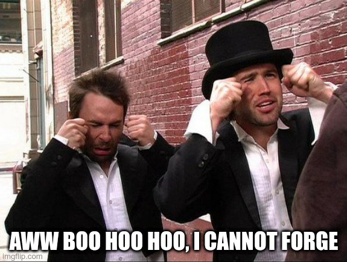

# FCSC 2023 Cry Me a River

Justin a implémenté son algorithme de signature électronique et vous met au défi de le casser.

Fichiers:
- [cry-me-a-river.py](cry-me-a-river.py) 

Auteur : [Cryptanalyse](https://x.com/Cryptanalyse)

Origine : [Cry Me a River](https://hackropole.fr/fr/challenges/crypto/fcsc2023-crypto-cry-me-a-river/)

-----------

## Connectez vous en WEBSSH
> http://localhost

#### tentez 
> nc cry-me-a-river.cyrhades.fr 4000

-----------

## Ou directement avec netcat
> nc localhost 4000

-----------

## Installation manuel
Vous n'utilisez pas l'application **les CTFs de Cyrhades** ? C'est dommage !
Mais voici comment installer ce CTF manuellement :

> git clone https://github.com/Hack-Oeil/fcsc2023-crypto-cry-me-a-river.git

> cd fcsc2023-crypto-cry-me-a-river

-----------

## Sur le site officiel hackropole.fr
> https://hackropole.fr/fr/challenges/crypto/fcsc2023-crypto-cry-me-a-river/